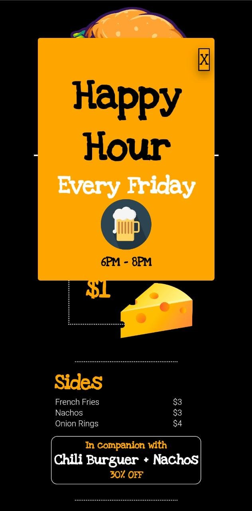
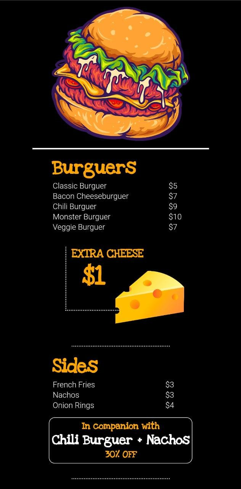

<h1 align="center"> Menu digital </h1>

## 💻 Sobre o projeto
Projeto de Menu digital que poderia ser usado por food trucks e bares via QR Code utilizando **HTML**, **CSS** e **JAVASCRIPT**.

## Autor

Feito por ***Rafael Morais***
 
👋🏽 Entre em contato!

